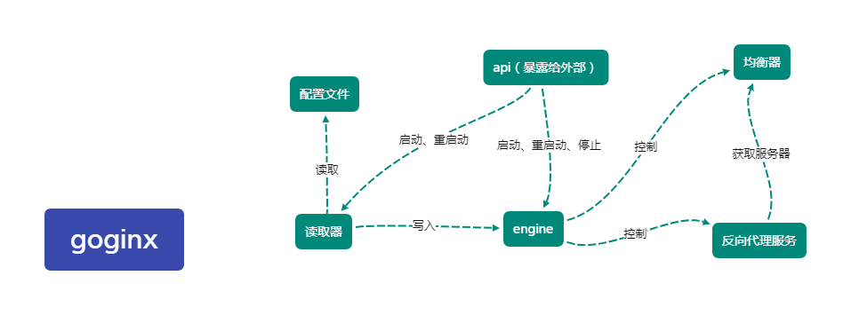

# goginx
 go语言实现nginx

---
## 使用流程
- 按照规范填写配置文件（在`goginx.exe`目录下的config目录中），规范见 [config规范](#config规范)
- 运行`goginx.exe`。
- 以下为命令：
1. `start`--启动服务
2. `reset`--服务热重启
3. `stop`--停止服务

## config规范
### 标识符
- `[server]`-用于标示server块的开始

    server块下的字段有：
- - `listen`-监听的代理服务器端口
- - `[location]`-location块起始符，标示location块的开始。

    location块的字段有
- - - `type`-标示了location块的类型。有两类。`1`代表了location是均衡负载类型，`2`代表了location是提供本地静态文件服务。
- - - `root`-如果location的`type`为`2`，则该字段启用，表示文件在服务器中的位置。
- - - `upstream`-表示location使用的后端服务器池名。池名参考`upstream块`的内容。
- - - `replicas`-每个真实服务器节点对应的虚拟节点数，用于哈希一致性算法的建构。

- `[upstream]`-用于标示upstream块的开始

  upstream块下的字段有：
- - `name`-必须紧跟（不包括注释）在`[upstream]`标识符后。用于命名该后端服务器池。
- - `name`字段之后跟随后端服务器的ip地址

- `[name]`-用于标示每个块的结束。

## 项目机制图

